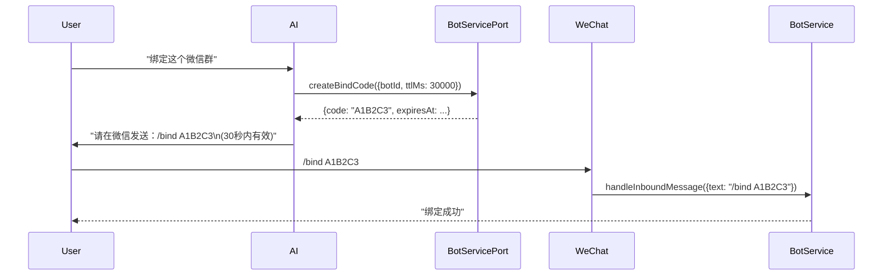

# AI 对话式 Bot 命令提案

## 背景

微信/飞书/Telegram Bot 接入后，用户需记忆并手敲 `/model` `/workspace` `/task` 等命令，体验割裂。现有 `IBotsService` 已实现完整命令逻辑，只需暴露给 AI Runtime。

**核心约束**：不同渠道能力不同（微信仅文本、飞书/Telegram 支持卡片/按钮），AI 工具必须**统一对外接口、内部按渠道降级**。

**核心原则**：**手动命令与 AI 对话双轨并行，共享同一核心执行层**。手动命令是兜底、是 AI 不可用时的生存线，绝不能去掉。

## 目标

让用户在**已实现且具备 Agent 会话能力的对话入口**（桌面主窗口、Bot 渠道、链路 A 的远程工作空间）用自然语言完成高频 Bot 操作。链路 B 与链路 C 不因本提案自动获得开会话或 attach 能力。

| 场景 | 现状 | 目标 |
|------|------|------|
| 切模型 | `/模型` → 选供应商 → 选模型 → 确认 | "换成 Sonnet" → AI 列出供应商 → 用户回数字 → AI 列出模型 → 用户回数字 → 完成 |
| 换工作区 | `/项目` → 列表 → 选序号 | "切到远程服务器" → AI 列出工作区 → 用户回数字 → 完成 |
| 新建/切任务 | `/新建` `/任务` → 列表 → 选序号 | "新建任务写登录页" / "切到上周重构任务" → AI 列出任务 → 用户回数字 → 完成 |
| 查状态 | `/状态` | "现在跑哪了" → AI 直接返回状态 |
| 重连远端 | `/重连` | "重连一下" → AI 直接执行 |
| 切换回复详细度 | `/回复` → 列表 → 选序号 | "回复详细点" → AI 列出选项 → 用户回数字 → 完成（飞书/Telegram）或 AI 告知"微信不支持" |
| 切换思考级别 | `/思考` → 列表 → 选序号 | "思考深一点" → AI 列出选项 → 用户回数字 → 完成（需模型支持） |

**渠道差异对照**（决定工具返回格式与可用命令）：

| 能力/命令 | 微信 | 飞书/Lark | Telegram | 桌面/Web |
|------|------|-----------|----------|----------|
| 结构化选择 | ❌ 仅回数字 | ✅ 按钮卡片 | ✅ Inline Keyboard | ✅ 原生 UI |
| 富文本/Markdown | ⚠️ 受限 | ✅ 完整 | ✅ 完整 | ✅ 完整 |
| 图片/文件直发 | ✅ | ✅ | ✅ | ✅ |
| 实时流式回复 | ❌ | ✅ Streaming Card | ⚠️ 编辑消息 | ✅ |
| 权限按钮 | ❌ | ✅ | ✅ | ✅ |
| **/model 切模型** | ✅ 文本选数字 | ✅ 卡片选 | ✅ Keyboard 选 | ✅ 原生选 |
| **/workspace 换项目** | ✅ 文本选数字 | ✅ 卡片选 | ✅ Keyboard 选 | ✅ 原生选 |
| **/task 任务管理** | ✅ 文本选数字 | ✅ 卡片选 | ✅ Keyboard 选 | ✅ 原生选 |
| **/status 查状态** | ✅ | ✅ | ✅ | ✅ |
| **/reconnect 重连** | ✅ | ✅ | ✅ | ✅ |
| **/new /stop** | ✅ | ✅ | ✅ | ✅ |
| **/thoughtLevel 思考级别** | ✅（模型支持时） | ✅ | ✅ | ✅ |
| **/reply 回复详细度** | ❌ **不支持** | ✅ | ✅ | ✅ |
| **/mode 运行模式** | ❌ **锁死 yolo** | ❌ **锁死 yolo** | ❌ **锁死 yolo** | ❌ **锁死 yolo** |
| **登录/绑定** | 手机扫码 + 手发 `/bind` | 手机扫码/设备码 + 手发 `/bind` | BotFather 取 token + 手发 `/bind` | UI 点击扫码 |

**关键规则**：
- 微信不支持 `/reply`、`/mode` → AI 检测到微信渠道时**不返回这些选项**，并告知用户"当前渠道不支持"
- 所有渠道 `/mode` 锁死 yolo → AI 直接返回错误"Bot 强制 yolo 模式，不支持切换"
- 登录/绑定**全程人工**，AI 只能生成码提示，不能代劳

## 远程控制边界（必须先于实现遵守）

本提案中的 `BotProvider` 与远程控制链路是两个正交维度，不能把微信、飞书、Telegram 直接等同于某一条远程链路：

| 维度 | 事实 | 本提案的处理 |
|------|------|-------------|
| Bot 渠道 | `weixin` / `feishu` / `lark` / `telegram` / `webhook`，负责入站消息、按钮和文本渲染 | 由 `getBotChannelCapabilities()` 决定返回格式与命令可用性 |
| 链路 A：远程工作空间 | 本机经 SSH / WSL / Docker 外联，在目标机启动新的 Agent；远端执行面和 workspace 状态属于远端 Host | 支持 Bot 命令，但必须在对应远端 Host 的 `workspaceIdentity` 上执行 |
| 链路 B：Web / 局域网 | 客户端拨入本机 `zcode-server`；当前只能访问服务和文件，不能开会话 | 不把 Web 客户端列为本提案的 Agent 工具注入目标；仅在已有会话能力出现后另行接入 |
| 链路 C：手机远控 / 公网 hub | 通过外部 relay attach 到桌面已有会话；当前只有类型契约，没有生产消费者 | 本提案不实现、不验收、不复用其 `mobileRemote`、`relay_bridge` 或死代码 attach 函数 |

### 链路 A 的状态与依赖边界

- `workspaceIdentity` 是命令寻址和隔离的唯一键，优先使用 `workspaceIdentity?.trim() || workspacePath`；远端 identity 继续由现有 remote-workspace identity 工具构造，不能在 Bot 工具中手写格式。
- 链路 A 的执行面在远端 Host；身份、凭据和本地设置仍由桌面侧注入。`BotsServicePort` 必须跟随实际持有任务、模型和 workspace 事实的 Host 注入，不能让桌面侧再维护一份 Bot 命令状态。
- `remoteSessionId` 仅作为协议路由和会话关联字段传递，不能替代 `workspaceIdentity`，也不能让 relay 或 Main 保存任务队列、快照等业务状态。
- 链路 A 远程 Host 当前已经装配 `IBotsService`，但 `runStartupBackgroundTasks: false` 只表示不在远端 Host 启动 Bot 轮询；它不等于链路 C attach，也不意味着可从手机公网拨入。

### 三条链路的实现范围

```text
Bot 消息入口（微信/飞书/Telegram）
              │
              ▼
    持有实际 Agent 会话的 Host
       ├─ 本地桌面 Host                 ← 本提案 Phase 1
       └─ 链路 A 远程 workspace Host      ← 本提案 Phase 1/2

链路 B Web/LAN：现有服务访问能力，不新增 Agent 会话工具
链路 C 手机/hub：仅未来 attachment 合同，不在本提案实现
```

## 架构设计：双轨并行，共享核心

```
┌─────────────────────────────────────────────────────────────────┐
│                      用户输入                                    │
└─────────────────────────────────────────────────────────────────┘
                              │
              ┌───────────────┴───────────────┐
              ▼                               ▼
    ┌─────────────────────┐           ┌─────────────────────┐
    │  手动命令轨道        │           │  AI 对话轨道         │
    │  /model /workspace  │           │  "换模型" "切项目"    │
    │  /task /status      │           │  自然语言            │
    └──────────┬──────────┘           └──────────┬──────────┘
               │                                 │
               ▼                                 ▼
    ┌─────────────────────┐           ┌─────────────────────┐
    │ Bot 消息解析器       │           │ AI 模型              │
    │ parseBotCommand()   │           │ 调用 bot_command     │
    │ → command + args    │           │ tool calling         │
    └──────────┬──────────┘           └──────────┬──────────┘
               │                                 │
               └───────────────┬─────────────────┘
                               ▼
                    ┌─────────────────────────┐
                    │  统一核心执行层           │
                    │  BotsServicePort.        │
                    │  executeBotCommand()     │
                    │  (复用 handleModelList   │
                    │   handleWorkspaceSet 等)  │
                    └─────────────┬───────────┘
                                  │
                                  ▼
                    ┌─────────────────────────┐
                    │  返回统一数据结构         │
                    │  BotCommandExecutionResult│
                    │  {options, textGuidance,  │
                    │   step, currentValue...}  │
                    └─────────────┬───────────┘
                                  │
              ┌───────────────────┼───────────────────┐
              ▼                   ▼                   ▼
    ┌───────────────┐   ┌───────────────┐   ┌───────────────┐
    │ 微信渲染       │   │ 飞书/Telegram │   │ AI 回复生成    │
    │ textGuidance  │   │ options→卡片  │   │ 自然语言+引导  │
    │ "回复数字:    │   │ 按钮/Inline   │   │ "请回复 1/2"  │
    │  1) Anthropic│   │ Keyboard      │   │               │
    └───────────────┘   └───────────────┘   └───────────────┘
```

### 核心设计：同一核心，双表现层

| 层 | 手动命令 (`/model`) | AI 工具 (`bot_command`) |
|----|---------------------|-------------------------|
| **入口** | `handleInboundMessage` → `parseBotCommand` | AI `tool_call` → `bot_command` handler |
| **参数解析** | 从文本解析 `/model list` → `{command: 'model', action: 'list'}` | AI 直接传结构化参数 |
| **核心执行** | **同一个** `executeBotCommand(params)` | **同一个** `executeBotCommand(params)` |
| **返回数据** | **同一个** `BotCommandExecutionResult` | **同一个** `BotCommandExecutionResult` |
| **表现层** | `buildSelectionReply()` → 纯文本数字选择 | 直接返回给 AI，AI 组装自然语言回复 |
| **渠道适配** | 在 `formatBotMessage` / `createSelectionReply` 里按渠道渲染 | 在 Port 里按 `channel` 返回 `options` 或 `textGuidance` |

**代码复用（零重复）**：
```typescript
// 1. 手动命令入口（现有，保留不动）
async function handleInboundMessage(message: BotInboundMessage) {
  const parsed = parseBotCommand(message.text);
  if (parsed.type === 'command') {
    const result = await executeBotCommand({
      command: parsed.command,
      action: parsed.action ?? 'list',
      payload: parsed.payload,
      workspaceIdentity: context.workspaceIdentity,
      botId: message.botId,
      channel: message.actor.provider,
    });
    return renderResultForChannel(result, message.actor.provider); // 现有渲染逻辑
  }
  // 普通消息走 AI
}

// 2. AI 工具入口（新增，复用同一核心）
async function executeBotCommand(params: BotCommandExecutionParams) {
  // 环境感知：根据 channel 过滤不可用命令
  const caps = getBotChannelCapabilities(params.channel);
  if (!isCommandSupported(params.command, caps)) {
    return { success: false, error: `当前渠道 ${params.channel} 不支持 ${params.command} 命令` };
  }
  
  switch (params.command) {
    case 'model':
      return params.action === 'list' ? handleModelList(params)
           : params.action === 'set' ? handleModelSet(params)
           : handleModelProviderSet(params);
    case 'workspace':
      return params.action === 'list' ? handleWorkspaceList(params)
           : handleWorkspaceSet(params);
    // ... 复用现有 handleXxx
  }
}

// 3. 渲染层分离
function renderResultForChannel(result: BotCommandExecutionResult, channel: BotChannel): BotOutboundMessage[] {
  const caps = getBotChannelCapabilities(channel);
  if (caps.supportsStructuredSelection) {
    return buildCardMessage(result.options, result.textGuidance); // 飞书/Telegram 卡片
  } else {
    return [{ text: result.textGuidance }]; // 微信纯文本
  }
}
```

### 环境感知与工具可用性控制

**运行时自动检测渠道能力，AI 无需感知**：

```typescript
// packages/services/src/bots/botsService.ts

// 渠道能力表（单一事实源）
function getBotChannelCapabilities(channel: BotChannel): BotChannelCapabilities {
  const base = {
    supportsMarkdown: channel !== 'weixin',
    supportsStreaming: channel === 'feishu' || channel === 'lark',
    supportsPermissionButtons: channel !== 'weixin',
    maxMessageLength: channel === 'weixin' ? 2048 : 4096,
  };
  
  return {
    ...base,
    supportsStructuredSelection: channel !== 'weixin', // 微信仅文本
  };
}

// 命令可用性矩阵
function isCommandSupported(command: string, caps: BotChannelCapabilities, modelSupportsThoughtLevel: boolean): boolean {
  switch (command) {
    case 'reply':
      return caps.supportsStructuredSelection; // 微信 false
    case 'mode':
      return false; // 所有渠道锁死 yolo
    case 'thoughtLevel':
      return modelSupportsThoughtLevel; // 依赖模型能力
    case 'model':
    case 'workspace':
    case 'task':
    case 'status':
    case 'reconnect':
    case 'new':
    case 'stop':
      return true; // 通用命令
    default:
      return false;
  }
}

// executeBotCommand 内部自动拦截
async executeBotCommand(params) {
  const caps = getBotChannelCapabilities(params.channel);
  const modelSupportsThought = await this.checkModelThoughtLevelSupport(params);
  
  if (!isCommandSupported(params.command, caps, modelSupportsThought)) {
    const reason = params.command === 'mode' 
      ? 'Bot 强制 yolo 模式，不支持切换'
      : params.command === 'reply'
        ? '微信渠道不支持切换回复详细度，仅飞书/Telegram 支持'
        : '当前环境不支持该命令';
    return { success: false, error: reason };
  }
  // ... 正常执行
}
```

**AI 侧无需做任何判断**——调用工具，工具返回 `error`，AI 原样转达用户。

---

## 架构设计详细规格

### 1. 新增 Port 定义（按渠道能力区分）

```typescript
// Port 的具体落位：按当前仓库 @zcode/contracts 与 Runtime Port 的公开入口约定确定；
// 不新增 packages/contracts/src/interfaces 这一不存在的目录。

// 渠道能力标识
export type BotChannel = 'weixin' | 'feishu' | 'lark' | 'telegram' | 'webhook';

export interface BotChannelCapabilities {
  supportsStructuredSelection: boolean;  // 是否支持按钮/卡片选择
  supportsMarkdown: boolean;
  supportsStreaming: boolean;
  supportsPermissionButtons: boolean;
  maxMessageLength: number;
}

// 统一查询渠道能力
export function getBotChannelCapabilities(channel: BotChannel): BotChannelCapabilities;

// BotServicePort - 供 AI Runtime 调用
export interface BotsServicePort {
  // === 渠道能力查询 ===
  getChannelCapabilities(botId: string): Promise<BotChannelCapabilities>;

  // === 登录/注册（仅桌面配置页用，AI 不直接调用） ===
  beginWeixinRegistration(): Promise<BotWeixinRegistrationBeginResult>;
  pollWeixinRegistration(params: BotWeixinRegistrationPollParams): Promise<BotWeixinRegistrationPollResult>;
  beginFeishuRegistration(params?: BotFeishuRegistrationBeginParams): Promise<BotFeishuRegistrationBeginResult>;
  pollFeishuRegistration(params: BotFeishuRegistrationPollParams): Promise<BotFeishuRegistrationPollResult>;

  // === 配置管理 ===
  getConfig(): Promise<BotsConfigFile>;
  saveBot(params: BotSaveBotParams): Promise<BotConfig>;
  removeBotSecret(botId: string): Promise<BotConfig>;
  deleteBot(botId: string): Promise<void>;
  testBot(botId: string): Promise<BotTestResult>;

  // === 运行时命令（AI 直接调用，返回结构化数据） ===
  getStatus(params: { workspaceIdentity?: string }): Promise<BotStatusResult>;
  listWorkspaceRefs(params: { workspaceIdentity?: string; currentWorkspace?: BotWorkspaceRef }): Promise<BotWorkspaceRef[]>;
  createBindCode(params: BotCreateBindCodeParams): Promise<BotBindCodeResult>;
  getBotStates(params: { workspaceIdentity?: string }): Promise<BotContextState[]>;
  resetBotState(contextKey: string): Promise<void>;

  // === 核心命令执行（统一入口，手动命令与 AI 共用） ===
  executeBotCommand(params: BotCommandExecutionParams): Promise<BotCommandExecutionResult>;

  // === 会话控制（供 automation 用） ===
  handleInboundMessage(message: BotInboundMessage): Promise<BotOutboundMessage[]>;
}

// 统一命令执行参数（AI 工具调用的标准输入，手动命令解析后也转为此格式）
export interface BotCommandExecutionParams {
  command: 'model' | 'workspace' | 'task' | 'status' | 'reconnect' | 'new' | 'stop' | 'thoughtLevel' | 'reply';
  action: 'list' | 'set' | 'execute';  // list=展示选项, set=确认选择, execute=直接执行
  payload?: {
    providerId?: string;
    modelId?: string;
    workspaceId?: string;
    taskId?: string;
    thoughtLevel?: string;
    replyMode?: string;
  };
  // 运行时自动注入（AI 不传，手动命令由上下文注入）
  workspaceIdentity?: string;
  remoteSessionId?: string;
  // 当前仅接受已存在的桌面连续会话；web-remote-replayable 属于链路 C 未来 attachment 合同，不在本提案实现
  clientMode?: 'desktop-continuous';
  botId?: string;  // 当前会话绑定的 bot
  channel?: BotChannel;  // 当前渠道，决定返回格式
}

// 统一命令执行结果（根据渠道能力自动适配）
export interface BotCommandExecutionResult {
  success: boolean;
  step?: 'select_provider' | 'select_model' | 'select_workspace' | 'select_task' | 'done';
  // 结构化选项（飞书/Telegram/桌面用 buttons/cards）
  options?: BotCommandOption[];
  // 文本引导（微信用纯文本数字选择）
  textGuidance?: string;
  // 当前值（用于显示"当前: xxx"）
  currentValue?: string;
  // 完成时的提示消息
  message?: string;
  // 错误信息
  error?: string;
}

export interface BotCommandOption {
  id: string;
  label: string;
  description?: string;
  isCurrent?: boolean;
}
```

### 2. Host 注入实现（本地 Host 与链路 A 远程 Host）

| 宿主 | 注入位置 | 说明 | BotServicePort 实现来源 |
|------|----------|------|------------------------|
| Desktop Local Host | `packages/desktop/src/main/desktopHost.ts` | 创建 `AgentRuntime` 时传入 | `createBotsService({runStartupBackgroundTasks: true})` |
| Remote Workspace Host (SSH/Docker/WSL) | `packages/desktop/src/host/remoteWorkspaceServiceCollection.ts` | 已注册 `IBotsService`，直接透传 | `createBotsService({runStartupBackgroundTasks: false})` |
| 链路 B Web/LAN | 当前无 Agent 会话能力 | 不注入 `BotsServicePort`，不新增工具 | 不适用 |
| 链路 C 手机远控 | 当前未实现 attach | 本提案不接入 | 不适用 |

```typescript
// 统一注入模式（在 AgentRuntime 创建处）
const runtime = new AgentRuntime({
  ...deps,
  botsServicePort: services.get(IBotsService), // 实现 BotsServicePort
});
```

**关键点**：当前代码可确认的是本地 Host 和链路 A 远程 workspace Host 的 `IBotsService` 装配；不能据此声称“手机远控 Host 已注册”。先在服务层增加命令执行能力，再在这两个真实 Host 的 Agent Runtime 工具注册路径注入；链路 B/C 必须等各自的会话/attachment 能力真实存在后单独设计。

### 3. 新增 AI 工具（`apps/zcode-cli/packages/core/src/tool/handlers/`）

**统一工具**：`bot_command` —— 单一入口，内部按 `command` 分发

| 工具名 | 封装命令 | 权限 | 备注 |
|--------|---------|------|------|
| `bot_command` | model/workspace/task/status/reconnect/new/stop/thoughtLevel/reply | `needsApproval: true` (写操作) | 统一入口，参数含 command+action+payload |

**为什么合并成单工具？**
- 避免工具列表膨胀污染提示词
- 模型只需学会一个工具的调用协议
- 内部路由复用现有 handler，零业务重复

**工具输入/输出**：

```typescript
// bot_command 统一接口
interface BotCommandInput {
  command: 'model' | 'workspace' | 'task' | 'status' | 'reconnect' | 'new' | 'stop' | 'thoughtLevel' | 'reply';
  action: 'list' | 'set' | 'execute';
  payload?: {
    providerId?: string;
    modelId?: string;
    workspaceId?: string;
    taskId?: string;
    thoughtLevel?: string;
    replyMode?: string;
  };
}

interface BotCommandOutput {
  success: boolean;
  step?: 'select_provider' | 'select_model' | 'select_workspace' | 'select_task' | 'done';
  options?: { id: string; label: string; description?: string; isCurrent?: boolean }[];
  textGuidance?: string;  // 微信专用：纯文本引导"回复数字选择"
  currentValue?: string;
  message?: string;
  error?: string;
}
```

**模型调用示例（AI 引导用户选数字）**：

```json
// 1. 用户："换模型"
AI 调用: { "command": "model", "action": "list" }
// Port 返回: { step: "select_provider", options: [...], textGuidance: "请回复数字选择供应商：1) Anthropic 2) OpenAI..." }
// AI 回复用户: "请选择模型供应商：\n1) Anthropic\n2) OpenAI\n3) GLM\n请回复数字"

// 2. 用户回复："1"
AI 调用: { "command": "model", "action": "set", "payload": { "providerId": "anthropic" } }
// Port 返回: { step: "select_model", options: [...], textGuidance: "请回复数字选择模型：1) claude-3-5-sonnet 2) claude-3-opus..." }
// AI 回复用户: "请选择具体模型：\n1) claude-3-5-sonnet\n2) claude-3-opus\n请回复数字"

// 3. 用户回复："1"
AI 调用: { "command": "model", "action": "set", "payload": { "modelId": "claude-3-5-sonnet" } }
// Port 返回: { success: true, step: "done", message: "已切换到 claude-3-5-sonnet" }
// AI 回复用户: "✅ 已切换到 claude-3-5-sonnet"
```

### 4. 渠道自适应返回格式（核心设计）

**同一个工具调用，根据 `channel` 自动返回不同格式**：

| 字段 | 微信 | 飞书/Lark/Telegram | 桌面/Web |
|------|------|-------------------|----------|
| `options` | ❌ 不返回 | ✅ 返回完整 options（渲染按钮卡片） | ✅ 返回（原生 UI 渲染） |
| `textGuidance` | ✅ `"请回复数字选择：1) Anthropic 2) OpenAI..."` | ❌ 不需要 | ❌ 不需要 |
| `step` | ✅ 必须有（引导多轮） | ✅ 有（但 UI 可单次完成） | ✅ 有 |

**实现位置**：`BotsServicePort.executeBotCommand` 内部：
```typescript
async executeBotCommand(params) {
  const channel = params.channel ?? (await this.getBotChannel(params.botId));
  const caps = getBotChannelCapabilities(channel);
  
  const result = await this.routeToHandler(params); // 复用现有 handleModelList 等
  
  // 统一格式转换
  return {
    ...result,
    options: caps.supportsStructuredSelection ? result.rawOptions : undefined,
    textGuidance: caps.supportsStructuredSelection ? undefined : this.buildTextGuidance(result.rawOptions),
  };
}
```

### 5. 手动命令解析 → 核心执行 → 渠道渲染（现有流程保留）

```typescript
// packages/services/src/bots/botsService.ts

// 现有 parseBotCommand 保留，解析出 command/action/payload
// 然后调用统一核心
const result = await executeBotCommand({
  command: parsed.command,
  action: parsed.action ?? 'list',
  payload: parsed.payload,
  workspaceIdentity: context.workspaceIdentity,
  botId: message.botId,
  channel: message.actor.provider,
});

// 然后用现有渲染逻辑（createSelectionReply / buildCardMessage）
return renderResultForChannel(result, message.actor.provider);
```

### 6. 工作区上下文自动推导

**无需用户指定工作区**，运行时自动带上：

```typescript
// ToolExecutorDeps 已包含
workspaceIdentity?: string;    // "local:/path" 或 "remote:ssh:host:port:user:/path"
remoteSessionId?: string;
clientMode?: "desktop-continuous"; // 当前实现范围；手机 replay attachment 另案设计

// BotServicePort 实现内部自动用当前 workspaceIdentity 过滤
async executeBotCommand(params) {
  const currentIdentity = params.workspaceIdentity ?? this.getCurrentWorkspaceIdentity();
  const bot = await this.getBoundBot(params.botId, currentIdentity);
  // 只返回 bot.allowedWorkspaces 范围内的工作区
  // 只操作当前 workspaceIdentity 对应的任务/模型
}
```

### 7. 绑定流程（AI 辅助但不可代劳）



---

## 用户体验对比（手动 vs AI）

| 场景 | 手动命令（原生保留） | AI 对话（新增） |
|------|---------------------|-----------------|
| **切模型** | `/模型` → Bot 回列表 → 回 `1` → 回模型列表 → 回 `1` → 完成 | "换成 Sonnet" → AI 列供应商 → 用户回 `1` → AI 列模型 → 用户回 `1` → 完成 |
| **换工作区** | `/项目` → 列表 → 回 `2` → 完成 | "切到远程服务器" → AI 列工作区 → 用户回 `2` → 完成 |
| **新建任务** | `/新建` → 发需求 | "新建任务写登录页" → AI 创建草稿 → 提交 prompt |
| **查状态** | `/状态` | "现在跑哪了" → AI 直接返回 |
| **AI 不可用** | ✅ 完全可用 | ❌ 自动降级提示用户用手动命令 |
| **新用户** | 需记忆语法 | 自然语言零门槛 |
| **高频用户** | 手快、无开销 | 适合复杂组合意图 |

---

## 实施计划

### Phase 1：核心基础设施（1-2 天）
- [ ] 按现有 Runtime Port 公开入口落位 `BotsServicePort`，并导出 `getBotChannelCapabilities`；不得新建不存在的 `packages/contracts/src/interfaces` 路径
- [ ] 在 `IBotsService` 添加 `executeBotCommand` 方法，内部路由到现有 `handleModelList/Set`、`handleWorkspaceList/Set` 等 (`packages/services/src/bots/bots.ts`)
- [ ] 仅在 Desktop Local Host 与链路 A Remote Workspace Host 注入 `botsServicePort` 到实际 Agent Runtime；先用 `pnpm architecture:context` 确认入口，再改 `desktopHost` / `remoteWorkspaceServiceCollection`
- [ ] 新增 `includeBotTools` 开关 + 注册 `bot_command` 单一工具 (`apps/zcode-cli/packages/core/src/tool/handlers/index.ts`)

### Phase 2：单工具落地（~1 天）
- [ ] **`bot_command`** 完整实现：输入验证 → 调用 Port → 返回自适应格式
- [ ] 渠道能力表 `getBotChannelCapabilities` 实现（微信/飞书/Telegram/Webhook）
- [ ] 文本引导生成 `buildTextGuidance`（微信专用）
- [ ] 单元测试：模拟微信/飞书/桌面三种渠道返回格式差异

### Phase 3：验证与补齐（~0.5 天）
- [ ] 桌面 TUI 端到端：`bot_command` 切模型/换工作区/任务管理
- [ ] 微信 Bot 端到端：纯文本数字选择流程
- [ ] 飞书/Telegram：按钮卡片渲染（复用现有卡片逻辑）
- [ ] 远程 workspace：重连、工作区切换
- [ ] **回归测试**：手动命令 `/model` `/workspace` `/task` 等完全不受影响

### Phase 4：登录辅助（可选，~0.5 天）
- [ ] `bot_feishu_login_begin` / `poll` —— 仅桌面配置页用，AI 不直接暴露
- [ ] 微信登录**不提供 AI 工具**（必须手机扫码，无法自动化）

## 风险与对策

| 风险 | 对策 |
|------|------|
| 多入口工作区冲突 | `workspaceIdentity` 唯一标识，ServiceCollection 隔离，已验证 |
| 权限滥用 | 所有写操作工具加 `needsApproval`，首次确认后可勾选「不再询问」 |
| 远程 Host 无 Bots 权限 | `runStartupBackgroundTasks: false` 仅禁用后台轮询，查询类 API 正常 |
| 微信无结构化选择 | 统一工具返回 `textGuidance`，微信走纯文本数字选择；飞书/Telegram 走按钮卡片 |
| 渠道能力不一致导致体验割裂 | **单工具统一入口 + Port 内部按渠道自适应**，模型只调一个工具，不关心渠道差异 |
| 绑定码必须用户手发 | AI 只能生成码+提示，不能代发；文案明确告知「请在微信发送 `/bind XXX`」 |
| `/mode` 命令不可用 | 工具内部拦截，返回 `error: "Bot 强制 yolo 模式，不支持切换"`，AI 原样转达用户 |
| 思考级别/回复模式仅部分配置生效 | `executeBotCommand` 内部校验当前模型/渠道支持性，不支持时返回明确错误 |

## 完整链路验收标准

### 链路 1：桌面主窗口（desktop-continuous）
1. 用户："换成 Sonnet" → `bot_command(model, list)` → 返回 providers → 用户选 → `set_provider` → 返回 models → 用户选 → `set_model` → 成功
2. 用户："切到远程服务器" → `bot_command(workspace, list)` → 返回本地+远程列表 → 用户选 → 成功
3. 用户："新建任务写登录页" → `bot_command(task, execute, {action: 'new'})` → 创建草稿 → 提交 prompt
4. 用户："现在跑哪了" → `bot_command(status, execute)` → 返回格式化状态

### 链路 2：微信 Bot（weixin）
1. 用户发微信："换模型" → Bot 转发给 AI → AI 调用 `bot_command(model, list)` → Port 返回 `textGuidance: "请回复数字：1) Anthropic 2) OpenAI..."` → AI 原样回复用户
2. 用户回微信："1" → AI 调用 `bot_command(model, set, {providerId: 'anthropic'})` → 返回 models 文本引导
3. 用户回微信："1" → AI 调用 `set_model` → 成功
4. 用户："绑定这个群" → AI 调用 `createBindCode` → 回复「请发送 `/bind A1B2C3`」 → 用户在微信发送 → 绑定成功

### 链路 3：飞书/Telegram Bot（feishu/lark/telegram）
1. 同桌面，但返回 `options` 数组，Bot 端渲染为按钮卡片/Inline Keyboard
2. 用户点按钮 → Bot 回调 → AI 收到 selection → 直接调用 `set` 确认

### 链路 4：链路 B Web/LAN（当前不纳入）
1. 当前 Web 入口可访问服务和文件，但不能开 Agent 会话。
2. 因此不注入 `bot_command`，也不承诺从浏览器触发 Bot 命令。
3. 待 Web 会话能力和权限边界单独落地后，再定义工具注入和 replay 语义。

### 链路 5：链路 C 手机远控 / 公网 hub（当前不纳入）
1. 当前只有协议类型和 attachment 死代码，没有生产连接、消费者或 relay 配置。
2. 本提案不把 `web-remote-replayable` 当成已存在的手机入口，不把 `mobileRemote` 当成权限档位。
3. 未来实现必须先补充无状态 relay、配对/撤销凭证、owner/lease、attachment 路由和 replay 验收，再接入 `bot_command`。

### 链路 6：CLI headless（无 Bot 工具）
- `includeBotTools: false`，工具不注册，零污染；这不是远程链路，而是运行时工具面选择。

## 依赖与阻塞

- 无新增外部依赖
- 无数据库迁移
- 不新增远程控制协议，也不扩展 `RemoteTarget`；Bot 命令 Port 只在真实 Host 内部注入。
- 当前仓库已有 `@zcode/contracts` 包，但服务 descriptor 在 `packages/services/src/bots/bots.ts`；新增 Port 的实际目录和跨包导出必须先按仓库现有 Port 约定确认，不能假定存在 `packages/contracts/src/interfaces`。
- **需协调**：`packages/services/src/bots/bots.ts` 添加 `executeBotCommand` 方法（改动集中、可单独 PR）

## 后续扩展（Phase 5+）

| 扩展 | 说明 | 优先级 |
|------|------|--------|
| `bot_config_manage` | 增删改查 Bot 配置（新建/删除/启用禁用/改名） | 中 |
| `bot_bind_assist` | AI 生成绑定码 + 多渠道引导文案（微信/飞书/Telegram 差异化） | 中 |
| 多 Bot 统一管理 | `@bot-name 切模型` 语法，支持同工作区多 Bot 共存 | 低 |
| 自然语言参数解析 | "换成那个最强的 Claude" → 自动解析为 providerId/modelId | 低 |
| 批量操作 | "把所有远程项目都重连一下" | 低 |

## 附录：现有代码复用清单（零重复实现）

| 新增 Port 方法 | 复用的现有内部函数 |
|--------------|------------------|
| `executeBotCommand({command: 'model', action: 'list'})` | `handleModelList` + `listModelProviderOptionsForActiveTask` |
| `executeBotCommand({command: 'model', action: 'set', payload: {providerId}})` | `handleModelProviderSet` + `listModelOptionsForProviderFromActiveTask` |
| `executeBotCommand({command: 'model', action: 'set', payload: {modelId}})` | `handleModelSet` + `saveBot` |
| `executeBotCommand({command: 'workspace', action: 'list'})` | `handleWorkspaceList` + `filterAllowedWorkspaces` |
| `executeBotCommand({command: 'workspace', action: 'set', payload: {workspaceId}})` | `handleWorkspaceSet` + `writeDraftContext` |
| `executeBotCommand({command: 'task', action: 'list'})` | `handleTaskList` + `listContextTaskSelectionEntries` |
| `executeBotCommand({command: 'task', action: 'set', payload: {taskId}})` | `handleTaskSet` + `writeContext` |
| `executeBotCommand({command: 'task', action: 'execute', payload: {action: 'new'}})` | `handleNew` + `writeDraftContext` + `sendPromptInBackground` |
| `executeBotCommand({command: 'task', action: 'execute', payload: {action: 'stop'}})` | `handleStop` |
| `executeBotCommand({command: 'status', action: 'execute'})` | `handleStatus` + `formatStatusModelLabel` |
| `executeBotCommand({command: 'reconnect', action: 'execute'})` | `handleReconnect` + `reconnectRemoteWorkspaceForBot` |
| `executeBotCommand({command: 'thoughtLevel', action: 'list'})` | `handleThoughtLevelList` + `listDraftConfigOptions` |
| `executeBotCommand({command: 'thoughtLevel', action: 'set', payload: {thoughtLevel}})` | `handleThoughtLevelSet` + `saveBot` |
| `executeBotCommand({command: 'reply', action: 'list'})` | `handleReplyList` + `getReplyGranularityOptions` |
| `executeBotCommand({command: 'reply', action: 'set', payload: {replyMode}})` | `handleReplySet` + `saveBot` |
| `getChannelCapabilities(botId)` | `isFeishuBotProvider` + `supportsStructuredSelection` 逻辑 |
| `createBindCode` | 现有 `createBindCode` 直接暴露 |
| `getBotStates` | 现有 `getBotStates` 直接暴露 |

---

**文档版本**：v2.1（补充远程控制三链路边界，移除未实现手机远控承诺）  
**决策状态**：待评审  
**负责人**：待指定