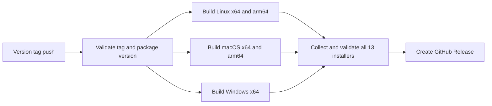

# GitHub Desktop Release

## Behavior

- Pushing a valid `v<package version>` tag builds production desktop installers on native GitHub-hosted runners.
- The supported release set is Linux x64/arm64 (AppImage, deb, rpm, and pacman), macOS x64/arm64 (dmg and zip), and Windows x64 (NSIS exe).
- The workflow publishes installer files only as assets on the matching GitHub Release. It does not publish through electron-builder or upload to other release services.
- Manual workflow dispatch is for building selected platform targets and uploading temporary workflow artifacts; it never creates a GitHub Release.
- A release is created only after every required build and installer validation succeeds.

## Ownership and Invariants

- GitHub Actions owns trigger routing, build fan-out, artifact handoff, and GitHub Release creation.
- Each native runner owns building its platform/architecture artifact. The publish job is the sole owner of release asset publication.
- Release tags must exactly match the root package version (`v` + `package.json` version).
- Release builds explicitly use `ZCODE_ENV=production` and `ZCODE_PREVIEW_IDENTITY=0`.
- electron-builder publishing is disabled in build jobs; only the publish job uses `gh release create` or `gh release upload` to publish assets.
- Build jobs need read-only repository access. Only the publish job receives `contents: write`; checkout credentials are not persisted.

## Event Order

The three build jobs run independently after preflight. The publish job is the only writer and runs only after all builds succeed and the complete installer set is present.

## Failure Semantics

- Invalid tag syntax or a tag/package version mismatch fails before platform builds start.
- Any missing target installer or failed build blocks GitHub Release creation; incomplete builds are not published.
- Build artifacts remain available on the workflow run for diagnosis and retry. If a Release already exists for the tag, a rerun uploads the validated installers and replaces same-named assets so an interrupted upload can be completed.
- Re-running a workflow for an existing tag executes the workflow definition at that tag's commit; workflow fixes must be included in the commit referenced by the release tag.

## Acceptance Scenarios

1. A `vX.Y.Z` tag matching `package.json` builds the complete production installer set and attaches only those installers to a GitHub Release.
2. A malformed `v*` tag or a version mismatch fails in preflight without spending time on platform builds.
3. A manual dispatch with selected platforms uploads workflow artifacts but does not create a GitHub Release.
4. A failed or incomplete platform build prevents the publish job from running.
5. No build job invokes an external publisher or has write access to repository contents.
